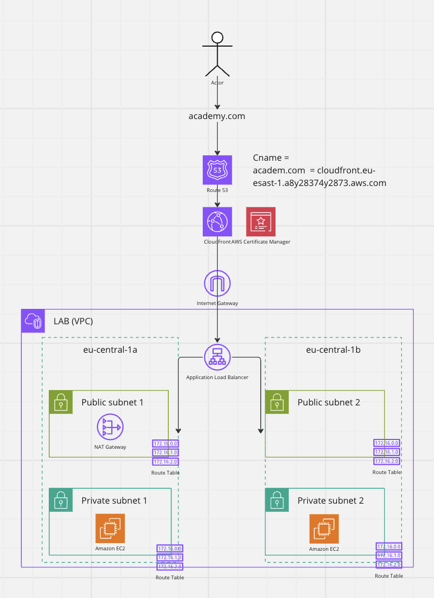

# AWS Infrastructure Setup with Terraform

This project automates the setup of a robust AWS infrastructure using Terraform. By executing the Terraform configurations in this repository, you will create a comprehensive environment that spans across multiple aspects of AWS, focusing on high availability, security, and scalability. The infrastructure is deployed in the `us-east-1` (Virginia) AWS region.

  

## Overview

The Terraform scripts in this project will perform the following actions:

### Virtual Private Cloud (VPC)

- **Create VPC**: Establish a VPC to securely host all the resources.
- **Subnets**: Create 1 public and 1 private subnet in each of the two Availability Zones (AZs) - `us-east-1a` and `us-east-1b`.
- **Internet Gateway**: Attach an Internet Gateway to the VPC for public internet access.

### Application Load Balancer (ALB)

- **ALB Creation**: Deploy an Application Load Balancer that spans the two Availability Zones.
- **Target Group**: Set up a target group for routing traffic to EC2 instances located in the private subnets.

### NAT Gateway

- **NAT Gateway Setup**: Place a NAT Gateway in one of the public subnets to enable internet access for instances in the private subnets.
- **Route Tables**: Configure route tables for the private subnets to use the NAT Gateway for internet traffic.

### CloudFront

- **CloudFront Distribution**: Create a CloudFront distribution with the ALB as its origin, for content delivery optimization.

### Route 53

- **Domain Registration**: Register a domain and set up a public hosted zone in Route 53.
- **DNS Records**: Create a DNS record to point the domain to the CloudFront distribution.

### AWS Certificate Manager

- **SSL/TLS Certificate**: Generate and validate an SSL/TLS certificate for the domain, enhancing security.
- **Certificate Association**: Assign the validated certificate to the CloudFront distribution for HTTPS support.

## Deployment

To deploy this infrastructure:

1. Ensure you have Terraform installed and configured with the appropriate AWS security credentials.
2. Navigate to the project directory and initialize Terraform with `terraform init`.
3. Apply the Terraform configuration with `terraform apply`, confirming the action when prompted.

## Notes
Feel free to prepare the access keys and the keypair in your AWS management console beforehand and update the variables.tf file according to your actual data.

This project uses a file named web.sh as a bootstrap code for EC2 (In my case, I used it to host my front-end project website via nginx). Dependencies on NAT Gateway and Route Tables were set to wait for the initialization (In order for the bootstrap code to work properly), but just in case, feel free to add a small bash function in the beginning of your script that checks if the instance can actually connect to the internet, if not, add a delay of 10-12 seconds and try again (5 cycles, 60 seconds in total)

If you are using a service which provides a domain outside of AWS Route53, After running `terraform apply`, you will get an error stating that no certificate exists in the current region, this is because it needs to be validated first.

1. Copy each NS values from Route 53 (with no . at the end) and copy them into the DNS settings of your provider
2. Wait for the certificate to be validated on ACM (Should take between 5 to 30 minutes if everything was set up properly)
3. Re-run `terraform apply` once you see the green `Issued` text on the certificate's description field and CloudFront, along with the Route53 (CNAME Record) will be provisioned and your project will now be accessable on your domain's website.

In addition, a troubleshooting machine is being started due to the configuration in the alb.tf, this machine was used to test and fix the configurations on the EC2 machines in the private subnet. Feel free to comment it out or adjust it to your needs.

This project simplifies the process of setting up a complex AWS environment, leveraging Terraform for infrastructure as code (IaC) to ensure consistency and repeatability.